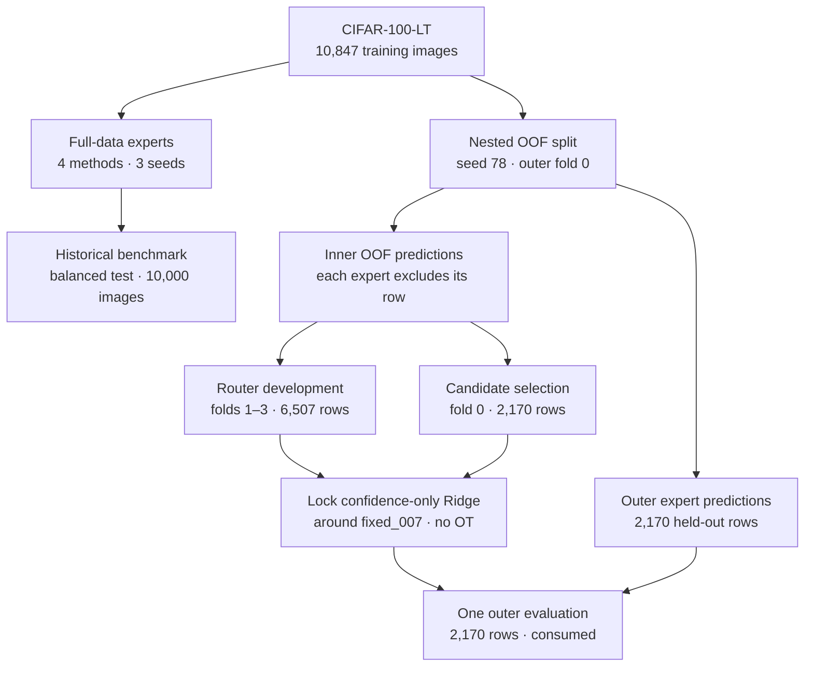
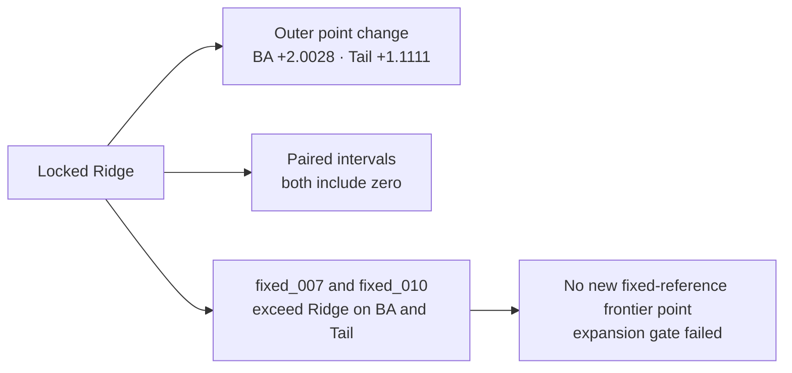

# Expert Routing on Long-Tailed CIFAR-100

## Abstract

We test whether four differently trained classifiers can improve rare-class
recognition on CIFAR-100-LT (imbalance ratio 100) through fixed mixtures or
inference-time routing. The repository reports a three-seed full-data benchmark
and a separate nested out-of-fold (OOF) development study with one locked
outer-fold evaluation. The OOF Ridge candidate improved on uniform logits by
point estimate, but its paired intervals include zero and fixed mixtures beat
it on both primary metrics; the prespecified expansion gate failed.

## Problem statement and objectives

Long-tailed data has many examples of common classes and few examples of rare
classes. We ask whether experts trained with different objectives make
complementary predictions, and whether a router can use inference-time signals
to combine them.

The target is to improve both Balanced Accuracy (BA) and Tail accuracy over
uniform logit averaging. BA is mean per-class recall; Head, Medium, and Tail
are macro recall within the canonical class groups. The original balanced test
set has been used for historical full-data evaluation and is excluded from OOF
router development. A multi-seed method succeeds only when both improvements
have consistent direction across configured seeds and valid provenance.

## Pipeline architecture

The project follows two separate tracks from the same long-tailed training
population:

In the OOF track, every prediction comes from an expert that excluded that
image from training. Inner fold 0 had earlier descriptive exposure in Task 3C;
the locked candidate was evaluated once on the disjoint outer fold. The
original balanced test set was not used for OOF development or evaluation.
Both tracks use ResNet-32 experts trained with CE, LAL, BalancedSoftmax, and
Mixup. Full-data runs use seeds 78, 88, and 1034; completed OOF evidence uses
seed 78.

## Key findings and contributions

- On the historical full-data track, uniform logits beat the valid probability
  average and confidence-selection baselines on both BA and Tail.
- On the single-seed OOF development set, several fixed convex mixtures
  improved both metrics over uniform logits.
- A label-dependent soft-mixture oracle found 55.5569% macro feasibility and
  26.3644% Tail feasibility. This measures possible headroom, not a router's
  ability to predict useful weights.
- Full 13-feature Ridge reduced contribution-prediction error in all 15
  matched settings, including Tail, while its primary classification result
  was lower than confidence-only Ridge: 36.10% / 6.55% versus 36.55% / 7.38%
  BA / Tail.
- Frozen-price Sinkhorn failed its development gate, and no adaptive method
  passed the frozen expansion gate. The locked no-OT Ridge result does not
  establish an adaptive advantage.

## Results and evidence

All metrics below are percentages. Full-data values summarize three seeds on
the balanced test set. OOF development uses inner folds 1–3 (6,507 rows), and
outer results use one held-out fold (2,170 rows). These populations and
protocols differ; **do not compare their metric values directly**.

### Full-data benchmark

Three-seed mean ± standard deviation on the original balanced test set:

| Method | BA | Tail |
|:--|--:|--:|
| CE expert | 37.69 ± 0.73 | 8.67 ± 0.42 |
| LAL expert | 42.43 ± 1.53 | 23.49 ± 1.71 |
| BalancedSoftmax expert | 41.34 ± 0.78 | 22.60 ± 0.39 |
| Mixup expert | 38.69 ± 0.61 | 5.69 ± 0.34 |
| Uniform logits | 46.98 ± 0.69 | 18.76 ± 0.86 |
| Probability average | 45.95 ± 0.55 | 18.70 ± 0.50 |
| Confidence selection | 44.27 ± 0.46 | 18.69 ± 0.36 |

The historical TTA BA and Tail values are invalid after a verified augmentation
implementation defect. Related historical routing calibration values are also
invalid. See [full-data results](docs/results.md) for the audit and complete
benchmark.

### OOF development

One seed, inner folds 1–3 (6,507 rows):

| Method | BA | Tail |
|:--|--:|--:|
| Uniform logits | 35.9328 | 7.0094 |
| `fixed_006` | 37.2134 | 9.9115 |
| `fixed_007` | 36.4403 | 14.7290 |
| `fixed_010` | 36.4236 | 14.5055 |
| Confidence-only Ridge | 36.5502 | 7.3797 |
| Full 13-feature Ridge | 36.10 | 6.55 |

These are development results, not independent test performance.

### Locked outer-fold-0 evaluation

One held-out fold (2,170 rows); columns show the primary macro metrics:

| Method | BA | Tail |
|:--|--:|--:|
| Uniform original logits | 42.7006 | 15.8333 |
| Locked residual Ridge, no OT | 44.7035 | 16.9444 |
| `fixed_006` | 44.6348 | 17.2222 |
| `fixed_007` | 44.7248 | 18.6111 |
| `fixed_010` | 44.7298 | 23.3333 |

The locked Ridge's difference from uniform was +2.0028 BA points (paired 95%
interval −0.4956 to +4.5771) and +1.1111 Tail points (−5.0000 to +7.7778).
Both intervals include zero.

The candidate's point estimates improved on uniform, but uncertainty includes
zero and the frozen fixed references exceed it on both target metrics. The
prespecified fixed-reference Pareto-frontier expansion gate therefore failed.

## Limitations

- The balanced test set is historical and is not an untouched confirmation
  set.
- Completed OOF evidence uses one expert seed and one outer fold. Inner models
  share training data, and inner fold 0 had prior descriptive exposure.
- The five-fold, three-seed OOF matrix and new specialized experts have not
  been run; no adaptive router has passed the frozen success gates.

## Documentation

- [Protocol](docs/protocol.md): canonical data roles, folds, evaluation rules,
  artifact integrity, router contract, and diagnostic definitions.
- [Full-data results](docs/results.md): authoritative historical three-seed
  benchmark and audit details.
- [OOF results](docs/oof-results.md): Task 3C–3F synthesis and locked
  outer-fold evidence.
- [Research](docs/research.md): measured constraints, open questions, and
  literature.
- [Reproduction](docs/reproduction.md): commands and artifact locations.
