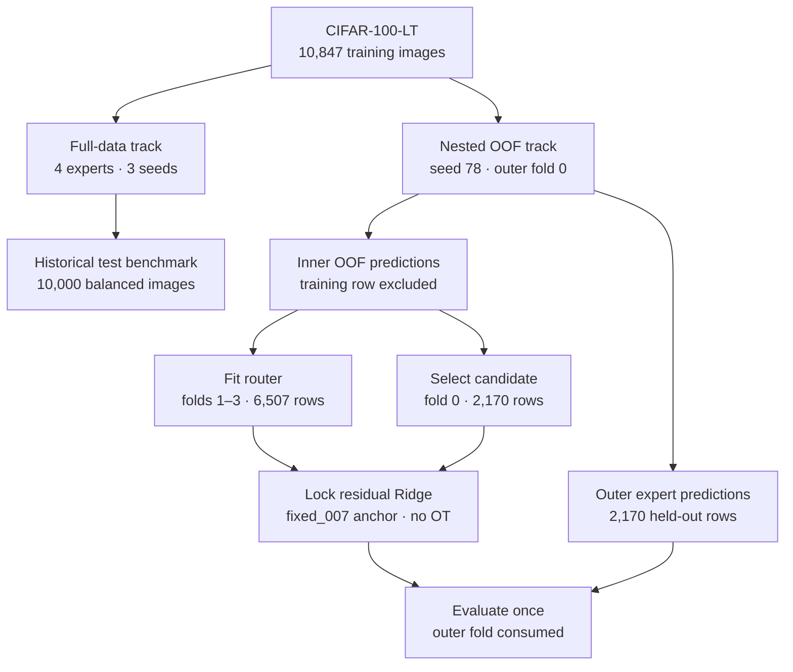
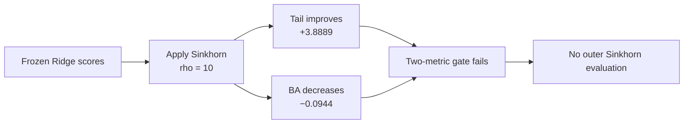
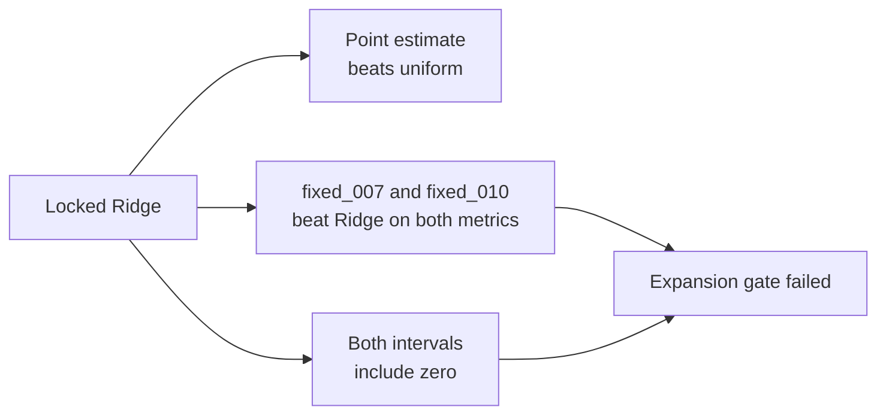

# Expert Routing on Long-Tailed CIFAR-100

**Research question:** Can four complementary classifiers be combined to
improve both overall class balance and rare-class recognition?

> [!IMPORTANT]
> **Current answer:** Fixed mixtures improve the OOF baseline, but the tested
> adaptive Ridge and Sinkhorn methods have not established an advantage over
> the strongest fixed mixtures.

| At a glance | Value |
|:--|:--|
| Dataset | CIFAR-100-LT, imbalance ratio 100 |
| Training population | 10,847 images |
| Experts | CE, LAL, BalancedSoftmax, Mixup |
| Primary metrics | Balanced Accuracy and Tail accuracy |
| Full-data seeds | 78, 88, 1034 |
| OOF evidence | Seed 78, outer fold 0 |
| Current status | Expansion gate failed |

## Start here: run or reproduce an experiment

New experiment work uses the config-driven CLI, not one-off command flags.
The study YAML defines scientific choices; the profile YAML defines paths,
device, shard, and session limits. Begin with validation and read-only
preflight:

```bash
python -m expert_method \
  --config configs/studies/ridge_sinkhorn_3seed_v1.yaml \
  --profile configs/profiles/local-smoke.yaml study validate
python -m expert_method \
  --config configs/studies/ridge_sinkhorn_3seed_v1.yaml \
  --profile configs/profiles/local-smoke.yaml study doctor
```

Before full runs, follow the [experiment workflow](docs/experiment-workflow.md)
for clean-commit freezing, Kaggle setup, resumable bundles, artifact layout,
and final reporting. See [configuration guidance](configs/README.md) for the
roles of expert recipes, studies, and runtime profiles. Historical scripts
remain available as compatibility utilities; they are not the canonical
interface.

On Kaggle, treat `configs/profiles/kaggle.yaml` as a template: copy it outside
the checkout and edit that copy, never the tracked file. For example:

```bash
export PROFILE=/kaggle/working/rs3-profile.yaml
cp configs/profiles/kaggle.yaml "$PROFILE"
```

Use `--profile "$PROFILE"` for subsequent commands. This preserves the clean
frozen checkout; the profile may vary by session except for its logical reuse
root names.

## Abstract

This study compares uniform ensembling, fixed expert mixtures, and adaptive
inference-time routing. It contains two separate experiments: a historical
three-seed benchmark on the balanced CIFAR-100 test set and a nested
out-of-fold (OOF) study with one locked outer-fold evaluation.

The locked Ridge router improved on uniform logits by point estimate, but its
paired intervals include zero. Two frozen fixed mixtures also exceeded it on
both primary metrics. Sinkhorn improved Tail accuracy in development while
reducing Balanced Accuracy, so it failed the predefined two-metric gate.

## Problem statement and objectives

| Question | Project definition |
|:--|:--|
| **Problem** | Common classes dominate long-tailed training data, while rare classes have very few examples. |
| **Objective** | Combine experts with different training objectives to improve rare-class recognition. |
| **Primary comparison** | Beat uniform logit averaging on both Balanced Accuracy (BA) and Tail accuracy. |
| **Success rule** | Both improvements must have consistent direction across configured seeds and valid provenance. |
| **Evaluation boundary** | The balanced test set is historical only and is excluded from OOF router development. |

### Metric definitions

- **BA:** mean recall across all 100 classes.
- **Head / Medium / Tail:** macro recall within the canonical frequency groups.
- **Tail accuracy:** the primary rare-class metric.

## Pipeline architecture



| Stage | What happens |
|:--|:--|
| **Experts** | Train ResNet-32 with CE, LAL, BalancedSoftmax, and Mixup objectives. |
| **OOF predictions** | Each prediction comes from an expert that excluded that image from training. |
| **Router fitting** | Ridge predicts per-image adjustments to a fixed expert mixture. |
| **Candidate lock** | Freeze the method and settings before loading outer artifacts. |
| **Outer evaluation** | Evaluate once on 2,170 held-out rows; do not reuse them for selection. |

> [!NOTE]
> Inner fold 0 had earlier descriptive exposure in Task 3C. The original
> balanced test set was not used by the OOF study.

## Key findings and contributions

| Finding | Evidence | Interpretation |
|:--|:--|:--|
| Uniform logits lead the valid full-data routing baselines. | 46.98 BA and 18.76 Tail | Simple logit averaging remains the historical reference. |
| Fixed mixtures improve OOF development results. | Best shown BA: 37.2134; best shown Tail: 14.7290 | Expert composition matters. |
| A soft-mixture oracle shows additional headroom. | 55.5569% macro and 26.3644% Tail feasibility | Feasible weights can exist, but the oracle uses labels. |
| Better target prediction did not improve classification. | Full features reduced MSE in 15/15 settings but scored 36.10 BA / 6.55 Tail | Lower regression error is insufficient. |
| Adaptive routing did not clear the final gate. | Fixed mixtures exceeded locked Ridge on BA and Tail | No adaptive advantage has been established. |

## Results and evidence

> [!CAUTION]
> Full-data, OOF-development, selection-fold, and outer-fold metrics come from
> different populations. **Do not compare values across those populations as
> if they were one benchmark.**

All values below are percentages.

### Full-data benchmark

Three-seed mean ± standard deviation on the historical balanced test set:

| Method | BA | Tail |
|:--|--:|--:|
| CE expert | 37.69 ± 0.73 | 8.67 ± 0.42 |
| LAL expert | 42.43 ± 1.53 | 23.49 ± 1.71 |
| BalancedSoftmax expert | 41.34 ± 0.78 | 22.60 ± 0.39 |
| Mixup expert | 38.69 ± 0.61 | 5.69 ± 0.34 |
| **Uniform logits (baseline)** | 46.98 ± 0.69 | 18.76 ± 0.86 |
| Probability average | 45.95 ± 0.55 | 18.70 ± 0.50 |
| Confidence selection | 44.27 ± 0.46 | 18.69 ± 0.36 |

> [!WARNING]
> Historical TTA BA/Tail values and related routing calibration values are
> invalid because of a verified augmentation defect. See the
> [full-data results](docs/results.md) for the audit.

### OOF development

One seed, inner folds 1–3, 6,507 rows. Fixed weights use expert order
`(CE, LAL, BalancedSoftmax, Mixup)`.

| Method | Weights | BA | Tail |
|:--|:--|--:|--:|
| Uniform logits | `(0.25, 0.25, 0.25, 0.25)` | 35.9328 | 7.0094 |
| `fixed_006` | `(0, 0.25, 0.25, 0.50)` | **37.2134** | 9.9115 |
| `fixed_007` | `(0, 0.25, 0.50, 0.25)` | 36.4403 | **14.7290** |
| `fixed_010` | `(0, 0.50, 0.25, 0.25)` | 36.4236 | 14.5055 |
| Confidence-only Ridge | Per-image | 36.5502 | 7.3797 |
| Full 13-feature Ridge | Per-image | 36.10 | 6.55 |

The `fixed_*` names are candidate IDs. Their weights remain constant for every
image; Ridge predicts different weights for each image. These are development
results, not independent test performance.

### Sinkhorn allocation diagnostic

Sinkhorn optimal transport adjusted frozen Ridge weights toward a declared
global expert-use prior on inner fold 0.

| Selection-fold method | BA | Tail |
|:--|--:|--:|
| Contribution Ridge, no OT | 38.0458 | 10.8333 |
| Frozen-price Sinkhorn, `rho = 10` | 37.9514 | 14.7222 |
| **Change from no OT** | **−0.0944** | **+3.8889** |



None of the predefined frozen-price strengths improved both metrics.
Batch-coupled Sinkhorn also remained diagnostic because one image's prediction
can depend on the other images in its batch.

### Locked outer-fold-0 evaluation

One held-out fold, 2,170 rows:

| Method | BA | Tail |
|:--|--:|--:|
| Uniform original logits | 42.7006 | 15.8333 |
| Locked residual Ridge, no OT | 44.7035 | 16.9444 |
| `fixed_006` | 44.6348 | 17.2222 |
| `fixed_007` | 44.7248 | 18.6111 |
| **`fixed_010`** | **44.7298** | **23.3333** |

| Ridge minus uniform | Point estimate | Paired 95% interval |
|:--|--:|:--|
| BA | +2.0028 | −0.4956 to +4.5771 |
| Tail | +1.1111 | −5.0000 to +7.7778 |



> [!IMPORTANT]
> The result does not justify the planned five-fold, three-seed expansion.
> Outer fold 0 is consumed and cannot be used to select a replacement method.

## Limitations

| Limitation | Consequence |
|:--|:--|
| Historical test reuse | The balanced test set is not an untouched confirmation set. |
| One OOF seed and outer fold | Generalization across seeds and folds is unknown. |
| Shared inner training data | OOF expert predictions are not statistically independent. |
| Prior fold inspection | Inner fold 0 is not an untouched selection population. |
| Expansion not run | No claim can be made for the planned five-fold, three-seed matrix. |

## Documentation

| Document | Purpose |
|:--|:--|
| [Protocol](docs/protocol.md) | Data roles, folds, evaluation rules, and artifact integrity |
| [Full-data results](docs/results.md) | Historical three-seed benchmark and audit details |
| [OOF results](docs/oof-results.md) | Task 3C–3F synthesis and locked outer-fold evidence |
| [Research](docs/research.md) | Measured constraints, open questions, and literature |
| [Reproduction](docs/reproduction.md) | Commands and artifact locations |
